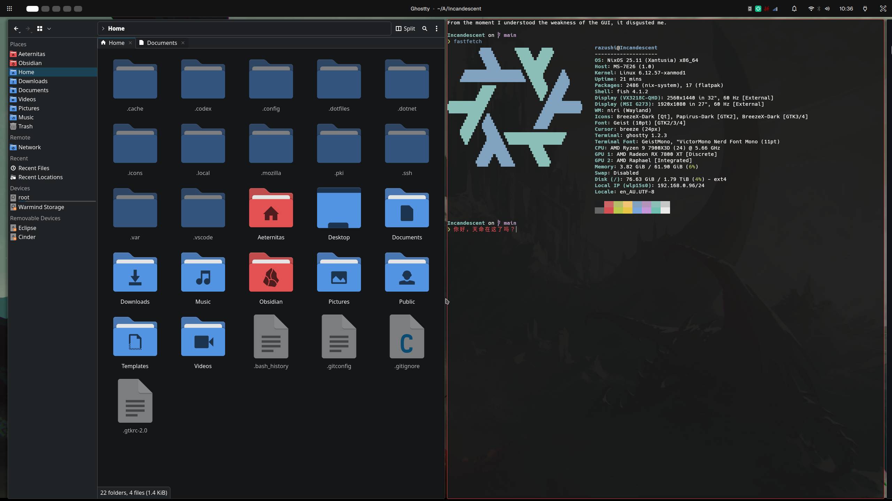
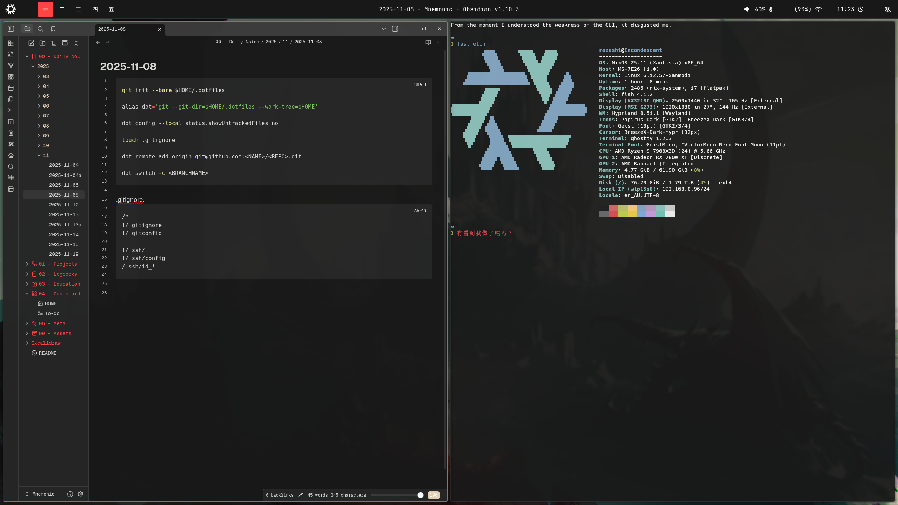

# Incandescent - My Glorious Desktop.

> [!NOTE]
> Let knowledge serve only man, and let that which does not remain in darkness.

This Nix configuration is located at: `Razushi/Incandescent`, and my dotfiles exist at: `Razushi/Dotfiles`. Due to my nature / method of dotfiles setup, seperate explicit and more broader setup notes and scripts are located together in: `Razushi/Anamnesis`.

<details>
<summary>Environment details</summary>
### Setup (overview)
| Area     | Choice(s)                                 |
| -------- | ----------------------------------------- |
| WM/DM    | Hyprland + Waybar / Niri + DMS / Plasma   |
| Shell    | Fish                                      |
| Terminal | Ghostty                                   |
| Editor   | Helix; VS Code                            |
| Launcher | Vicinae                                   |
| Browser  | Firefox; Brave                            |
</details>

# Rebuild:
> sudo nixos-rebuild $BUILD_OPTION --flake ~/Aeternitas/BRANCH/#HOSTNAME
OR
> cd <directory> && sudo nixos-rebuild $BUILD_OPTION --flake .#HOSTNAME


### Showcase:





### Repo Structure:
```
Incandescent/
├── hardware/
├── hosts/
├── modules/
│  ├── common.nix
│  ├── <module>.nix
│  └── default.nix
└── flake.nix
```
```
common.nix/
├── Bootloader
├── Locale
├── Display Manager
├── User
├── Drivers
├── Environment System Packages
│  └── Magic
├── Fonts
└── System Settings
```
